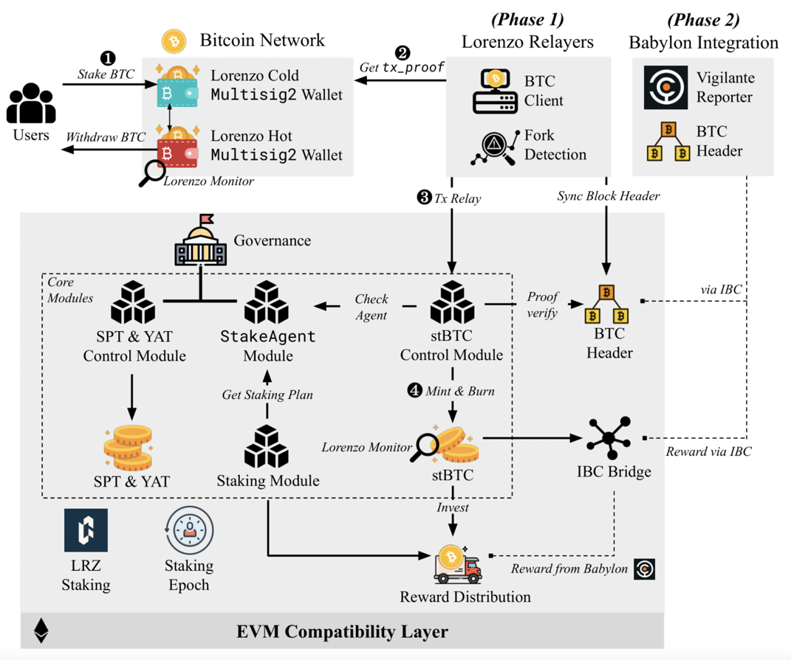

# Lorenzo

## Introduction

Lorenzo is the Bitcoin Liquidity Finance Layer. With the global adoption of Bitcoin growing, there is a significantly higher demand for Bitcoin liquidity, 
by ways of L2s, DeFi, trading, etc., and platforms are promising yield in exchange for Bitcoin liquidity. 
Babylon’s idea of Bitcoin Shared Security - restaking Bitcoin liquidity to Proof of Stake (PoS) chains for rewards is a prime example of providing Bitcoin liquidity in exchange for yield. 
Lorenzo creates an efficient market in which Bitcoin holders can easily find the best opportunities to invest their unused Bitcoin liquidity and serves as the premier DeFi ecosystem in which to finance Bitcoin restaking tokens.
To incentivize users to stake Bitcoin liquidity, Lorenzo tokenizes staked Bitcoin into Liquid Principal Tokens (LPTs) and Yield Accruing Tokens (YATs) for each restaking transaction.
Lorenzo also provides the infrastructure for exchanging LPTs and YATs, as well as honoring yield from restaking.

## Architecture
Lorenzo is the liquidity finance layer of Bitcoin. Lorenzo matches users who stake BTCs to Babylon, and turns Babylon’s staked BTCs into BTC liquid restaking tokens, releasing liquidity to the downstream DeFi ecosystem. That is, Lorenzo is a platform for the issuance, trading, and settlement of BTC liquid restaking tokens. It consists of a Cosmos appchain built with the Cosmos Ethermint, a relayer system that synchronizes BTC L1 and the Lorenzo appchain, and a system responsible for issuing and settling BTC liquid restaking tokens.

Lorenzo’s top priority is to assist projects that require Bitcoin restaking to obtain Bitcoin. Conversely, through Lorenzo, Bitcoin holders are able to find decent yielding opportunities by getting matched with projects that desire Bitcoin liquidity. Lorenzo also aims to tokenize BTC restaking and unlock the liquidity that is locked due to restaking. With Lorenzo, we together build a decentralized financial world based on BTC liquid restaking tokens. Lorenzo’s mainnet will be launched in two phases, which are described in details below.

## Build and Install
Please follow this [guide](https://docs.lorenzo-protocol.xyz/user-guides/set-up-a-node) to set up your local node.